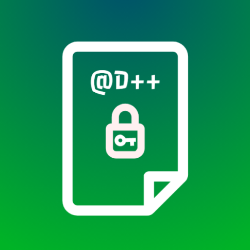

	
	<h2 align="center">Encrypt Notes</h2>
	
Also known as Cryptography D++ 2.0

	
	
	
	
	
	 
	 
	

This app is an updated version of the original Cryptography D++ app. You can find legacy version (1.4.1) here: https://github.com/dariopereiradp/CriptografiaD_Android.
This new version has a different package name and different signature. So, you need to install a new app, instead of update. Version 1.4.1 is the last version of the old app and it won't be updated anymore.

This app targets API 30, Android 11 devices. Minimum API required is API 26, Android 8.0. However, some functionalities may not work properly on this versions (for example: Dark theme is only supported on Android 10+ and [see below](#known-bugs) the bug with device credentials authentication).
--------

# App structure

## Activities
- ### SplashActivity extends BaseActivity
	SlashScreen activity. It also receives extras when it's opened by a notification. Then it will call LoginActivity with extras, if necessary.
- ### LoginActivity extends BaseActivity
	Activity that handle fingerprint (or similar) authentication. Also, if user opens the app through a notification while app is closed, it will go to this activity, and the method openActivity() will decide which activity/fragment will be open on authentication success.
- ### BaseActivity extends AppCompatActivity
	Activity that stores some important constants. However, the main functionality is to change the language and the app theme. All other activities must extend BaseActivity. It overrides attachBaseContext(Context newBase) method to ensure the same language and theme in all activities from the app.
- ### MainActivity extends BaseActivity
	Activity that contains all fragments.
- ### EditNoteActivity extends BaseActivity
	Activity to Edit a note whose ID is get via extras or creates a new one if no ID is provided.
- ### ImageViewerActivity extends BaseActivity
	Simple activity to view a image using an ImageView and Glide
	
## Fragments
- ### NotesFragment extends BaseActivity
	A fragment to show all notes stored on DB and to handle click, long click and swipe to delete.
- ### SettingsFragment
	Settings fragment with options: change name, import picture from Google account, language and theme.
- ### AboutFragment
	Fragment that shows a HTML file (in english or portuguese, according to selected language) that describes the app

## Adapters
If I want to change design if the future, I need to change these files:
- ### NotesAdapter
- ### note_layout.xml

## Databases
This app uses Room to store data on database. It contains 1 databases file. It has a class (Note.java), an interface (dao) and a DB extends RoomDatabase
- ### NotesDB

## Other important notes
- ### About notification
	Notification system uses WorkManager API. Every work has a specific uniqueWorkName. In case of note notifications, each note that has a reminder, has a different work name (that is, the id). A note can have only a single reminder at a time, but can create new reminders since the previous has been passed or cancelled.

- ### About backup & restore
	This app has two backup options. The first one is automatic and it's always enabled. It backups app data to Google Drive and automatically restores when reinstalling the app. Android System does it automatically. However, this option is not good, because the user has no control over it, and may loose data because of the frequency (it's like once a day). So I decided to give the users the chance to manually backup and restore. Of course, the best option was the sync data to a server and automatically access it once you login (as Google Keep for example). But, I don't have a server and I don't want to pay for one. So, I created another method, that is, in BackupHelper class, the app creates a single file, called "dp.cryptd.backup" that is a zip file containning all database and shared preferences files, as well profile pictures. I manually get these files, by getting their locations, copying it and adding it to a zip file. Then, it connects to Google Drive a upload it to a folder. Restore will look for a file named "dp.cryptd.backup" on user's Google Drive account, download it, extracts zip file to a temporary folder, closes databases, copy and replace files, delete temporary files and restarts the app so that everything may work as expected. However, the user only needs to click one button to backup and one button to restore and, of course, needs to give permission to Google Drive access. I'm using Google Drive REST API since Drive API is deprecated. Also, giving the fact that Google may soon deprecate apps folders on Google Drive, I didn't use this kind of approach. Instead, I manually create a new folder ("Encrypt Notes") on Google Drive root folder and store data there. The problem is that the user can delete or modify the content, that is not protected. The app doesn't do any kind of content verification. It only looks for a file with that name, downloads it and tries to import the content on the app. The worse that can happen is not restore anything and the app data will stay big, if user modifies zip content. Because it automatically extracts everything and then it verifyes every file for their name, copy and delete. If there is an extra file on zip, it will be extracted but not copyed to db or deleted.
	I didn't give the option to manually backup to phone's storage because of the no-sense Android restrictions, trying to make it like iOS and destroying file system. It was very hard to write a file to a persistent location, that would remain even if the app was uninstalled, and that's exactly the purpose of a backup. So, I gave up of this idea. It was in my plans let the users choose between automatically restore or manual restore, giving them the possibility to choose a backup file from file system (they could download it from Google Drive and copy to their phone or even rename the file on Google Drive). But I also gave up of this idea, because it was complicating a lot something that should be simple and functional.

- ### About language and themes
	BaseActivity is responsible to change app language and app theme in attachBaseContext(Context newBase) method. That's why all activities must extend this one.

--------

<html>
   <h2>Encrypt Notes</h2>
   <h3>Version 1.0 - 2021.03.05</h3>
   
Source code: 

   <a href="https://github.com/dariopereiradp/EncryptNotes">Github</a>
<h3>Functionalities</h3>
<li><strong> Notes</strong></li>

    - You can use notes tab to save whatever you want in text notes.

    - You can also use it to add reminders. You can set a reminder by clicking on the bell icon and
    choosing a day and hour to get a notification.

    - You can search for a note using the search bar. The app will search for notes that match
    the text (not case sensitive) in the title or note text, including encrypted notes.

    - Once you open a note, it will be possible to change the note background. You can also
    share it with other apps by clicking on the share button.

    - You may want to write a secret thing. The app offers you the possibility to encrypt and
    decrypt your notes. It is possible to make multiple encryptions of the same text.
    Each encryption will be associated with a specific password, which may be different from the
    others. To decrypt, it will be necessary to enter the decryption passwords in the reverse order
    to which they were entered. Please, pay attention that it's not possible to recover any
    password. So be careful while using it to save important things. It's useful to write your
    passwords with the correct order in other places (physical support or other apps).

    - To delete a note, long press the note card and check every note you want to delete and click
    on the Delete option that will apear. Or you can just swipe left the note card and confirm that
    you want to delete.

<li><strong> Settings</strong></li>

    - You can change your name and import your profile image from you Google account.

    - You can also choose a different language (at this moment, only English and Portuguese are
    supported).

    - You can switch the theme of the app between dark (better for reading and saving battery) and
    light mode. It's only supported on devices with Android 10+.

<li><strong> Google Backup and Restore</strong></li>

    - Click on Sign In button and choose your Google Account. Give the required permissions to
    import your name, email, profile picture and to have read and write access to your Google Drive
    account. The app can only read and access files generated by itself. Later you can sign-out of
    the app or disconnect account. The second action revokes all permissions given, but you can give
    them again later. The generated backup files are not deleted when you sign out or disconnect
    your account.

    - When you sign in, you can backup and restore databases and settings. A backup file named
    "dp.cryptd.backup" will be created in a folder called "Encrypt Notes" at your Google Drive
    account root folder. The app will show you the date and time of the last backup. You should make
    regular
    backups to guarantee you don't loose any important data.

    - To restore a backup, the app will search your Google Drive account for a backup file. For
    better results, you should not move, delete or modify the file. When you restore a backup, all
    your data and settings are replaced and lost! It's recommended that you restore a backup
    before you start using your app in a new device. Please note that when you sign in in a new
    device (or after reinstalling the app), the app may not find the last backup date, but it
    doesn't mean that a backup file doesn't exists! You can try to restore anyway.

<li><strong> About the app</strong></li>

    This is an updated version of the Cryptography D++ 1.4.1 app. The old app was discontinued. The
    new version has a redesigned interface, more friendly and modern. It also includes a lot of new
    features and improvements, including a search tool, reminders, note colors and many others!
    Enjoy it!

    - If you find an error or have any suggestions, don't hesitate to contact us!

 

    - About encryption: in this version the app uses AES Encryption Algorithm with ECB encryption
    mode, which is not safe at all. It may be possible to decrypt a note without password if
    someone has access to the database file where notes are stored. But only people with some
    level of knowledge in cryptographic algorithms will be able to do it, and it's not an easy task.
    However, to increase the safety of an important note, make multiple encryptions with different
    passwords and keep the backup file in Google Drive safe. But for normal daily use and if you
    only deal with "average" people, don't worry about that!

    - About data protection: DPSoft doesn't use or have any server. All your personal data and
    settings remain on your own device and your own Google Drive account (via auto-backup
    from Android and manual backup you do when you grant necessary permissions). DPSoft doesn't
    have access to any of your data! Pay attention that in the current version your data is not
    encrypted
    (except the notes you encrypted, that are stored in plain encrypted text) so, the security of
    your information depends on you and the protection mechanisms of Google and Android.

   

      © DPSoft 2021
   

</html>

# Known bugs:
- Security problem: if I receive a notification with the app open but do not open the notification; if then I close the app and open the notification, it won't go to the login page, but it will open the content without requiring password... This problem is caused because I create the notification intent in the moment that I receive the notification. I check if the app is open or not. If it is open, it doesn't need login. I didn't find a solution for that. Given the nature of the app, this is not so important, so maybe if I have some extra time I will search more and realese a future update to fix this security issue.
- On Android 8, 9 and maybe 10, it's not possible to authenticate with device pin/pattern. When I click this option, Android opens a new activity to enter the pin and closes my login activity, causing my app to close. When I enter the correct authentication or click on cancel, it goes to the Home Launcher of Android. However, it works on Android 11. On other versions, it still works using biometrics. I didn't test on Android 10. Note: With devices with no biometric authentication, it's possible to enter without any security. This is not a bug, but it's a decision. Maybe later, if I have some time, I will develop an authentication system for the app, independent of the device/system.
